---
## Front matter
title: "Лабораторная работа №2"
subtitle: "Архитектура вычислительных систем"
author: "Аделина Руслановна Галиева"

## Generic otions
lang: ru-RU
toc-title: "Содержание"

## Bibliography
bibliography: bib/cite.bib
csl: pandoc/csl/gost-r-7-0-5-2008-numeric.csl

## Pdf output format
toc: true # Table of contents
toc-depth: 2
lof: true # List of figures
lot: true # List of tables
fontsize: 12pt
linestretch: 1.5
papersize: a4
documentclass: scrreprt
## I18n polyglossia
polyglossia-lang:
  name: russian
  options:
	- spelling=modern
	- babelshorthands=true
polyglossia-otherlangs:
  name: english
## I18n babel
babel-lang: russian
babel-otherlangs: english
## Fonts
mainfont: PT Serif
romanfont: PT Serif
sansfont: PT Sans
monofont: PT Mono
mainfontoptions: Ligatures=TeX
romanfontoptions: Ligatures=TeX
sansfontoptions: Ligatures=TeX,Scale=MatchLowercase
monofontoptions: Scale=MatchLowercase,Scale=0.9
## Biblatex
biblatex: true
biblio-style: "gost-numeric"
biblatexoptions:
  - parentracker=true
  - backend=biber
  - hyperref=auto
  - language=auto
  - autolang=other*
  - citestyle=gost-numeric
## Pandoc-crossref LaTeX customization
figureTitle: "Рис."
tableTitle: "Таблица"
listingTitle: "Листинг"
lofTitle: "Список иллюстраций"
lotTitle: "Список таблиц"
lolTitle: "Листинги"
## Misc options
indent: true
header-includes:
  - \usepackage{indentfirst}
  - \usepackage{float} # keep figures where there are in the text
  - \floatplacement{figure}{H} # keep figures where there are in the text
---

# Цель работы

Изучить идеологию и применение средств
контроля версий. Приобрести практические навыки по работе с
системой git

# Задание

Здесь приводится описание задания в соответствии с рекомендациями
методического пособия и выданным вариантом.

# Выполнение лабораторной работы

Описываются проведённые действия, в качестве иллюстрации даётся ссылка на иллюстрацию (рис. [-@fig:001])

1. Сначала сделаем предварительную конфигурацию git.

{#fig:001 width=95%}

2. Настроим utf-8 в выводе сообщений git.

{#fig:002 width=95%}

3. Зададим имя начальной ветки(будем называть её master).

{#fig:003 width=95%}

4. Параметр autocrlf.

{#fig:004 width=95%}

5. Параметр safecrlf.

{#fig:005 width=95%}

6. Для последующей идентификации пользователя на сервере репозиториев необходимо сгенерировать пару ключей (приватный и открытый):

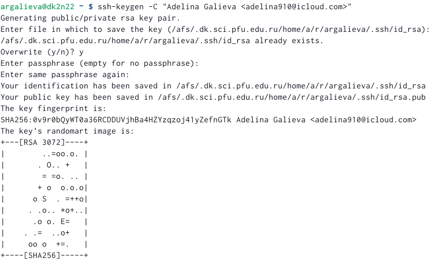{#fig:006 width=95%}

7. Далее загружаем сгенерённый открытый ключ на сайте http://github.org/ под своей учётной записью и переходим в меню Setting . После этого выбираем в боковом меню SSH and GPG keys и нажимем кнопку New SSH key.Далее копируем из локальной консоли ключ в буфер обмена.

{#fig:007 width=95%}

8. Вставляем ключ в появившееся на сайте поле и указываем для ключа имя(Title).

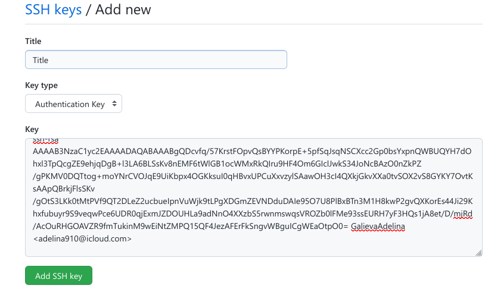{#fig:008 width=95%}

9. Открываем терминал и создаём каталог для предмета «Архитектура компьютера».

{#fig:009 width=95%}

10. Переходим в репозиторий https://github.com/yamadharma/course-directory-student-template и выбираем Use this template.

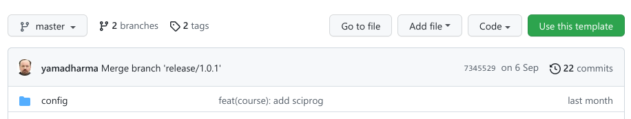{#fig:010 width=95%}

11. Задаём имя репозиторию и создаём репозиторий.

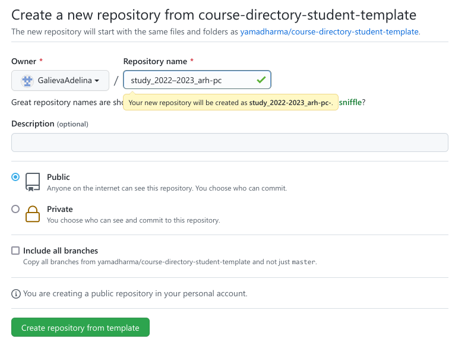{#fig:011 width=95%}

12. Открываем терминал и переходим в каталог курса.

{#fig:012 width=95%}

13. Далее копируем ссылку для клонирования созданного репозитория.

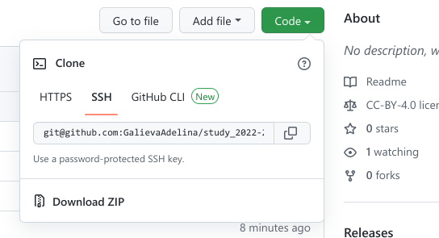{#fig:013 width=95%}

14. Клонируем созданный репозиторий.

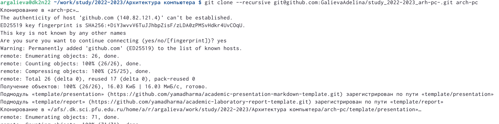{#fig:014 width=95%}

15. Переходим в каталог курса.

{#fig:015 width=95%}

16. Удаляем лишние файлы.

{#fig:016 width=95%}

17. Создаём необходимые каталоги.

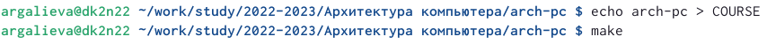{#fig:017 width=95%}

18. Отправляем файлы на сервер.

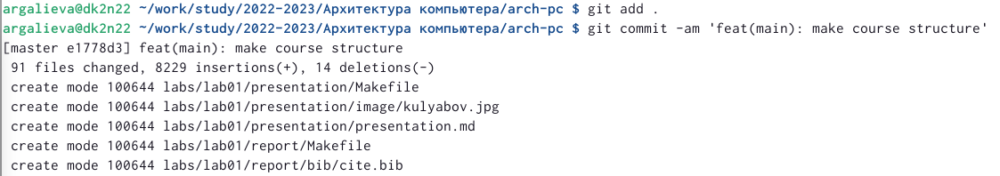{#fig:018 width=95%}

19. Отправка файлов.

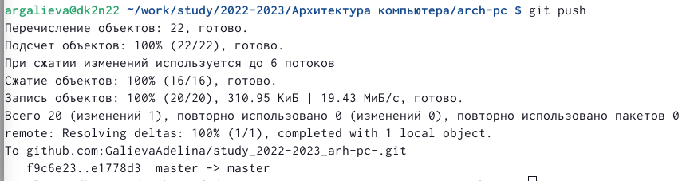{#fig:019 width=95%}

20. Проверяем правильность создания иерархии рабочего пространства в локальном репозитории и на странице github.

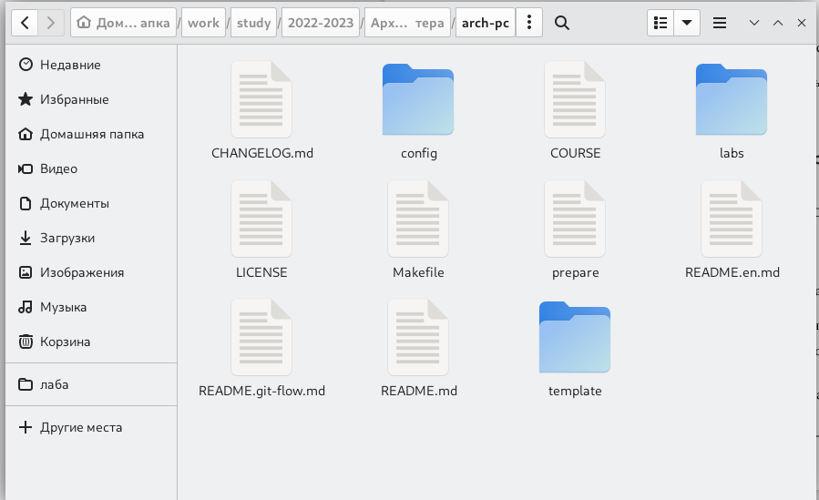{#fig:020 width=95%}

21.Проверяем правильность создания иерархии рабочего пространства на странице github.

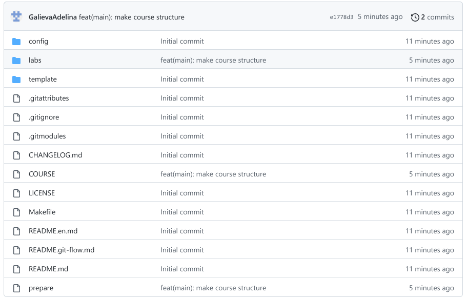{#fig:021 width=95%}

# Самостоятельная работа. 

Копируем отчёты по выполнению предыдущих лабораторных работ в соответствующие каталоги созданного рабочего пространства и загружаем файлы на https://github.com/GalievaAdelina/study_2022-2023_arh-pc

# Выводы

Я изучила идеологию и применение средств контроля версий.Приобрела практические навыки по работе с системой git.

