---
## Front matter
title: "Лабораторная работа №4"
subtitle: "Архитектура вычислительных систем"
author: "Аделина Руслановна Галиева"

## Generic otions
lang: ru-RU
toc-title: "Содержание"

## Bibliography
bibliography: bib/cite.bib
csl: pandoc/csl/gost-r-7-0-5-2008-numeric.csl

## Pdf output format
toc: true # Table of contents
toc-depth: 2
lof: true # List of figures
lot: true # List of tables
fontsize: 12pt
linestretch: 1.5
papersize: a4
documentclass: scrreprt
## I18n polyglossia
polyglossia-lang:
  name: russian
  options:
	- spelling=modern
	- babelshorthands=true
polyglossia-otherlangs:
  name: english
## I18n babel
babel-lang: russian
babel-otherlangs: english
## Fonts
mainfont: PT Serif
romanfont: PT Serif
sansfont: PT Sans
monofont: PT Mono
mainfontoptions: Ligatures=TeX
romanfontoptions: Ligatures=TeX
sansfontoptions: Ligatures=TeX,Scale=MatchLowercase
monofontoptions: Scale=MatchLowercase,Scale=0.9
## Biblatex
biblatex: true
biblio-style: "gost-numeric"
biblatexoptions:
  - parentracker=true
  - backend=biber
  - hyperref=auto
  - language=auto
  - autolang=other*
  - citestyle=gost-numeric
## Pandoc-crossref LaTeX customization
figureTitle: "Рис."
tableTitle: "Таблица"
listingTitle: "Листинг"
lofTitle: "Список иллюстраций"
lotTitle: "Список таблиц"
lolTitle: "Листинги"
## Misc options
indent: true
header-includes:
  - \usepackage{indentfirst}
  - \usepackage{float} # keep figures where there are in the text
  - \floatplacement{figure}{H} # keep figures where there are in the text
---

# Цель работы

Освоение процедуры компиляции и сборки программ, написанных на ассем-
блере NASM.

# Задание

1. В каталоге ~/work/arch-pc/lab05 с помощью команды cp создайте копию
файла hello.asm с именем lab5.asm
2. С помощью любого текстового редактора внесите изменения в текст про-
граммы в файле lab5.asm так, чтобы вместо Hello world! на экран выво-
дилась строка с вашими фамилией и именем.
3. Оттранслируйте полученный текст программы lab5.asm в объектный
файл. Выполните компоновку объектного файла и запустите получивший-
ся исполняемый файл.
4. Скопируйте файлы hello.asm и lab5.asm в Ваш локальный репозиторий
в каталог ~/work/study/2022-2023/"Архитектура компьютера"/arch-
pc/labs/lab05/. Загрузите файлы на Github.

# Выполнение лабораторной работы

Описываются проведённые действия, в качестве иллюстрации даётся ссылка на иллюстрацию (рис. [-@fig:001])

1. Создаём каталог для работы с программами на языке ассемблера NASM. 

{ #fig:001 width=95% }

2. Переходим в созданный каталог.

{ #fig:002 width=95% }

3. Создаём текстовый файл с именем hello.asm.

{ #fig:003 width=95% }

4. Откроем файл с помощью любого текстового редактора.

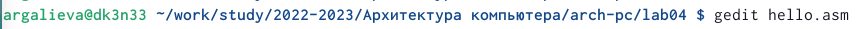{ #fig:004 width=95% }

5. Введём в него текст.

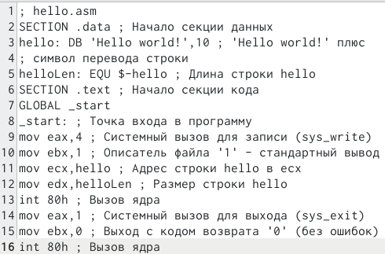{ #fig:005 width=95% }

6. При помощи транслятора NASM превратим текст в объектный код.

{ #fig:006 width=95% }

7. С помощью команды ls проверим, что объектный файл был создан.

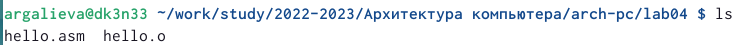{ #fig:007 width=95% }

8. Скомпилируем исходный файл hello.asm в obj.o.

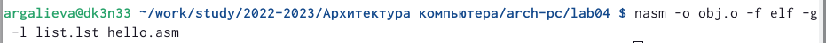{ #fig:008 width=95% }

9. С помощью команды ls проверяем, что файлы были созданы. 

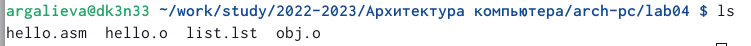{ #fig:009 width=95% }

10. Передаём на обработку компоновщику.

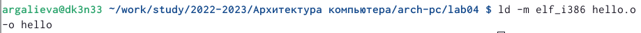{ #fig:010 width=95% }

11. С помощью команды ls проверяем, что исполняемый файл hello был создан. 

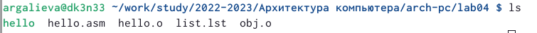{ #fig:011 width=95% }

12. При помощи ключа -o задаём имя файлу.

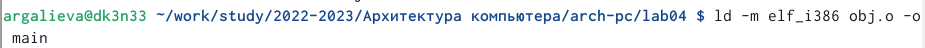{ #fig:012 width=95% }

13. Набрав ld --help посмотрим формат командной строки LD.

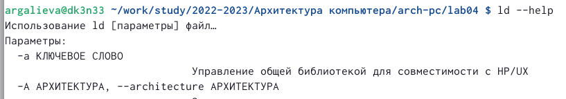{ #fig:013 width=95%}

14. Для получения более подробной информации посмотрим man ld.

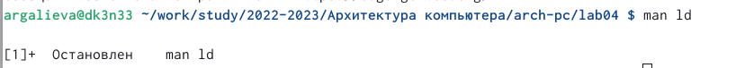{ #fig:014 width=95%}

15. Запустим на выполнение созданный исполняемый файл. 

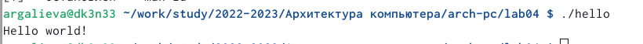{ #fig:015 width=95%}

# Самостоятельная работа

1. В каталоге ~/work/arch-pc/lab05 с помощью команды cp создадим копию
файла hello.asm с именем lab4.asm.

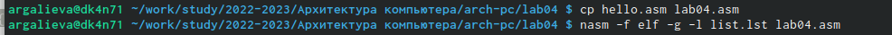{ #fig:016 width=95%}

2. С помощью любого текстового редактора внесем изменения в текст программы в файле lab4.asm так,чтобы вместо Hello world! на экран выводилась строка с нашими фамилией и именем.

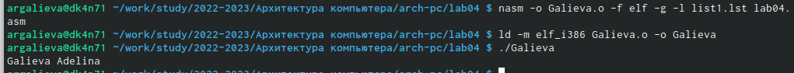{ #fig:017 width=95%}
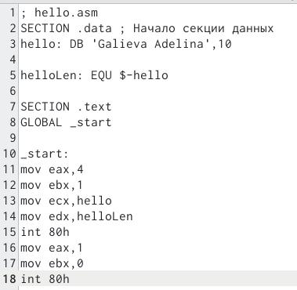{ #fig:018 width=95%}

3. Оттранслируем полученный текст программы lab4.asm в объектный файл.Выполним компоновку объектного файла и запустим получившийся исполняемый файл.

4. Скопируем файлы hello.asm и lab4.asm в наш локальный репозиторий в каталог ~/work/study/2022-2023/“Архитектура компьютера”/arch-pc/labs/lab04/.Загрузим файлы на Github.

# Вывод

Я освоила процедупы комплиляции и сборки программ, написанных на ассемблере NASM.

